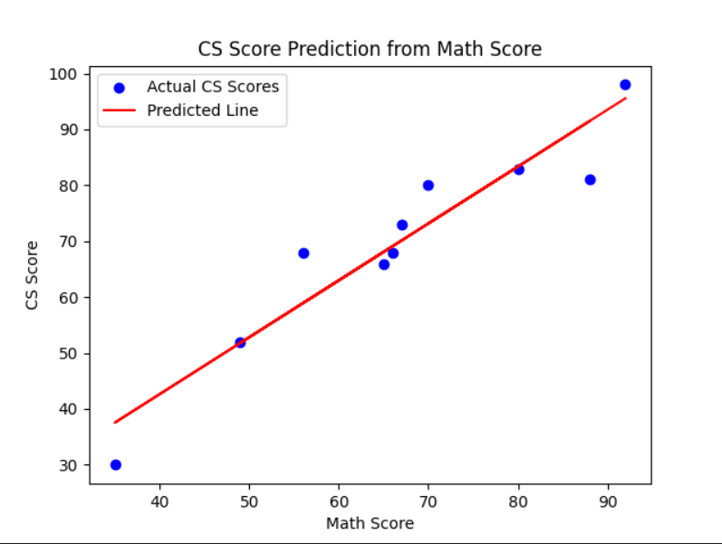

## For our reference

https://github.com/codebasics/py/blob/master/ML/3_gradient_descent/Exercise/ex_gradient_descent.py

https://www.youtube.com/watch?v=vsWrXfO3wWw&list=PLeo1K3hjS3uvCeTYTeyfe0-rN5r8zn9rw&index=4

## Here is gragh plot

